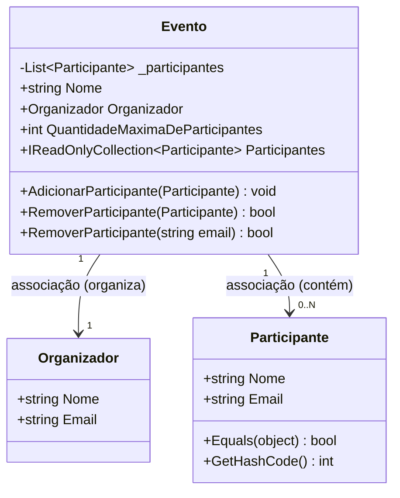

# Aula 007 — Associações entre Classes (C#)
### Projeto: `EventoParticipantes`

Este documento explica, de forma didática, os conceitos de **Programação Orientada a Objetos (POO)** aplicados neste projeto, com foco no conceito de **Associação entre classes**.

---

## 1. Visão geral do projeto

O projeto simula o cadastro de um **Evento**, que possui um **Organizador** e uma lista de **Participantes**. É um exemplo clássico de **associação** (um objeto "usa"/"conhece" outro, sem que um "faça parte" fisicamente do outro como em composição forte).

```
EventoParticipantes/
├── Program.cs              → Ponto de entrada, testa o comportamento das classes
└── Modelo/
    ├── Evento.cs            → Classe principal, associa Organizador e Participantes
    ├── Organizador.cs       → Representa quem organiza o evento
    └── Participante.cs      → Representa quem participa do evento
```

### Diagrama de associação



> **Associação 1:1** — Um Evento tem exatamente um Organizador.
> **Associação 1:N** — Um Evento pode ter vários Participantes (0 até o limite máximo).

---

## 2. Classe `Organizador`

```csharp
public class Organizador(string nome, string email)
{
    public string Nome { get; private set; } = nome;
    public string Email { get; private set; } = email;
}
```

**Conceitos aplicados:**

- **Construtor primário (Primary Constructor)** — recurso do C# 12 que permite declarar os parâmetros do construtor diretamente na assinatura da classe, eliminando a necessidade de escrever um construtor tradicional com `this.Nome = nome;`.
- **Encapsulamento** — as propriedades têm `private set`, ou seja, só podem ser alteradas **de dentro da própria classe**. De fora, só é possível **ler** (`get`), nunca **escrever diretamente**. Isso protege o estado do objeto.

---

## 3. Classe `Participante`

```csharp
public class Participante(string nome, string email)
{
    public string Nome { get; private set; } = nome;
    public string Email { get; private set; } = email;

    public override bool Equals(object? participante)
    {
        if (participante is not Participante p)
        {
            return false;
        }
        return this.Email == p.Email;
    }

    public override int GetHashCode()
    {
        return this.Email.GetHashCode();
    }
}
```

**Conceitos aplicados:**

### 3.1 Sobrescrita de `Equals`
Por padrão, o C# compara objetos por **referência** (mesmo endereço de memória). Aqui, sobrescrevemos `Equals` para comparar **por valor de negócio**: dois participantes são considerados "iguais" se tiverem o **mesmo e-mail**, mesmo sendo instâncias diferentes na memória.

```csharp
var p1 = new Participante("Carlos", "carlos@example.com");
var p2 = new Participante("Carlos", "carlos@example.com");

Console.WriteLine(p1 == p2);        // false → operador == compara referência
Console.WriteLine(p1.Equals(p2));   // true  → Equals foi sobrescrito
```

### 3.2 Por que sobrescrever `GetHashCode` junto com `Equals`?
Sempre que você sobrescreve `Equals`, **deve** sobrescrever `GetHashCode` também. Isso é uma regra de ouro do .NET, porque estruturas como `List<T>.Contains()`, `Dictionary`, `HashSet` usam o hash code para localizar objetos rapidamente antes de confirmar a igualdade com `Equals`. Se os dois métodos não forem consistentes, o comportamento da coleção fica **imprevisível**.

> Regra prática: *objetos iguais (Equals == true) devem ter o mesmo hash code.*

Isso é o que permite que o método `_participantes.Contains(participante)` em `Evento.cs` detecte duplicidade **pelo e-mail**, sem precisar escrever um laço manual comparando e-mails.

---

## 4. Classe `Evento` (o coração da associação)

```csharp
public class Evento(Organizador organizador, string nome, int quantidadeMaximaDeParticipantes)
{
    public string Nome { get; private set; } = nome;
    public Organizador Organizador { get; private set; } = organizador;
    public int QuantidadeMaximaDeParticipantes { get; private set; } = quantidadeMaximaDeParticipantes;

    private readonly List<Participante> _participantes = [];
    public IReadOnlyCollection<Participante> Participantes => _participantes.AsReadOnly();
    ...
}
```

### 4.1 Associação com `Organizador`
`Evento` guarda uma **referência** para um objeto `Organizador`. Isso é associação: o Evento "conhece" o Organizador, mas o Organizador existe de forma independente (poderia organizar vários eventos, por exemplo).

### 4.2 Associação com `Participante` (coleção)
```csharp
private readonly List<Participante> _participantes = [];
public IReadOnlyCollection<Participante> Participantes => _participantes.AsReadOnly();
```

- `_participantes` é **privado** — ninguém de fora da classe pode adicionar/remover participantes diretamente na lista.
- `Participantes` é uma **propriedade pública somente leitura** (`IReadOnlyCollection<Participante>`) que expõe uma "vitrine" segura da lista interna.
- Isso é um exemplo de **encapsulamento de coleções**: o mundo externo só pode alterar a lista **através dos métodos** `AdicionarParticipante` e `RemoverParticipante`, que aplicam regras de negócio (validações).

> Se `Participantes` retornasse a `List<Participante>` diretamente, qualquer código externo poderia chamar `evento.Participantes.Add(...)` e burlar todas as regras de negócio (limite de vagas, duplicidade de e-mail, etc.).

### 4.3 Método `AdicionarParticipante`

```csharp
public void AdicionarParticipante(Participante participante)
{
    if (_participantes.Count >= QuantidadeMaximaDeParticipantes)
    {
        throw new InvalidOperationException($"O evento {Nome} atingiu o limite máximo de participantes.");
    }

    if (_participantes.Contains(participante))
    {
        throw new InvalidOperationException($"O participante com o email {participante.Email} já está registrado no evento.");
    }

    _participantes.Add(participante);
}
```

Duas regras de negócio protegem a integridade dos dados:
1. **Limite de vagas** — não deixa ultrapassar `QuantidadeMaximaDeParticipantes`.
2. **Não duplicar participantes** — usa `_participantes.Contains(participante)`, que por baixo dos panos chama o `Equals` sobrescrito (comparação por e-mail).

Ambas as validações lançam `InvalidOperationException` quando a regra é violada — uma forma de comunicar erros de forma explícita e forçar quem chama o método a **tratar o problema** (veja o `try/catch` em `Program.cs`).

> No código há trechos comentados mostrando **três formas diferentes** de checar duplicidade: `foreach`, `for` tradicional e `LINQ Contains`. Isso é proposital — mostra a evolução de um código mais verboso para um mais expressivo usando LINQ.

### 4.4 Sobrecarga de método: `RemoverParticipante`

```csharp
public bool RemoverParticipante(Participante participante) { ... }
public bool RemoverParticipante(string email) { ... }
```

Isso é chamado de **sobrecarga de métodos (overloading)**: dois métodos com o **mesmo nome**, mas **assinaturas diferentes** (parâmetros diferentes). O compilador decide qual versão chamar com base no tipo do argumento passado:

```csharp
evento.RemoverParticipante(participante);        // usa a versão que recebe Participante
evento.RemoverParticipante("carlos@example.com"); // usa a versão que recebe string
```

A versão que recebe `string email` usa **LINQ** para buscar o participante:

```csharp
var participante = _participantes.FirstOrDefault(p => p.Email == email);
```

`FirstOrDefault` percorre a coleção e retorna o primeiro item que satisfaz a condição (expressão lambda), ou `null` se nenhum for encontrado — muito mais legível do que um `foreach` manual.

---

## 5. Analisando o `Program.cs` passo a passo

```csharp
var organizador = new Organizador("João", "joao@example.com");
var evento = new Evento(organizador, "Evento de Tecnologia", 1);
```
Cria um organizador e um evento com **limite de apenas 1 participante**.

```csharp
try
{
    evento.AdicionarParticipante(new Participante("Carlos", "carlos@example.com"));
    evento.AdicionarParticipante(participante); // Shi
}
catch (InvalidOperationException ex)
{
    Console.WriteLine($"Erro: {ex.Message}");
}
```
- O primeiro `AdicionarParticipante` (Carlos) **funciona**, pois o evento está vazio (0 < 1).
- O segundo `AdicionarParticipante` (Shi) **lança exceção**, pois o limite de 1 participante já foi atingido.
- O `catch` captura a exceção e exibe a mensagem, **sem quebrar o programa**.

```csharp
if (evento.RemoverParticipante("carlos@example.com"))
{
    Console.WriteLine("Participante com email carlos@example.com removido com sucesso.");
}
```
Remove o Carlos usando a sobrecarga por `string email`, liberando a vaga.

```csharp
Console.WriteLine("Participantes do evento:");
foreach (var p in evento.Participantes)
{
    Console.WriteLine($"Nome: {participante.Nome}, Email: {participante.Email}");
}
```
> ⚠️ **Atenção, alunos!** Este `foreach` percorre `evento.Participantes` usando a variável `p`, mas dentro do laço imprime `participante.Nome` (a variável externa "Shi"), e **não** `p.Nome`. Esse é um **bug proposital** para exercício em sala — o resultado impresso sempre mostrará "Shi", mesmo que a lista de participantes do evento esteja vazia após a remoção do Carlos. **Correção correta seria usar `p.Nome` e `p.Email` dentro do laço.**

```csharp
// evento.AdicionarParticipante(null);
// evento.Participantes = listaDeParticipantes;
```
Duas linhas comentadas mostram, propositalmente, código que **não compilaria/não deveria ser permitido**:
- `AdicionarParticipante(null)` — falharia porque `Nullable` está habilitado no projeto (`<Nullable>enable</Nullable>`) e o parâmetro não é anulável (poderia usar `ArgumentNullException.ThrowIfNull`, que está comentado dentro do método).
- `evento.Participantes = listaDeParticipantes` — não compila porque `Participantes` só tem `get` (propriedade calculada, sem `set`), reforçando o encapsulamento.

---

## 6. Conceitos-chave para revisão

| Conceito | Onde aparece | Por quê importa |
|---|---|---|
| **Associação** | `Evento` → `Organizador`, `Evento` → `Participante` | Modela relações entre entidades do mundo real |
| **Encapsulamento** | `private set`, `_participantes` privado | Protege o estado interno do objeto contra alterações indevidas |
| **Construtor primário** | Todas as classes | Sintaxe mais enxuta para inicializar propriedades |
| **Sobrescrita de `Equals`/`GetHashCode`** | `Participante` | Permite comparar objetos "por valor" (e-mail) em vez de referência |
| **Exceções (`throw`/`try-catch`)** | `Evento.AdicionarParticipante` / `Program.cs` | Comunica e trata erros de regra de negócio de forma controlada |
| **Sobrecarga de métodos** | `RemoverParticipante(Participante)` / `RemoverParticipante(string)` | Mesmo nome, comportamentos diferentes conforme o tipo do parâmetro |
| **LINQ** | `Contains`, `FirstOrDefault` | Consultas expressivas sobre coleções, substituindo laços manuais |
| **Coleções somente leitura** | `IReadOnlyCollection<Participante>` | Expõe dados sem permitir modificação externa direta |

---

## 7. Exercícios sugeridos

1. **Corrija o bug** do `foreach` em `Program.cs` para exibir corretamente todos os participantes atuais do evento (use `p.Nome` e `p.Email`).
2. Aumente `QuantidadeMaximaDeParticipantes` para 3 e teste adicionar múltiplos participantes sem exceção.
3. Implemente um método `ListarParticipantes()` em `Evento` que retorne uma string formatada com todos os nomes.
4. Descomente `ArgumentNullException.ThrowIfNull(participante, nameof(participante));` e teste chamar `AdicionarParticipante(null!)` — observe a exceção lançada.
5. Crie uma nova classe `Palestra` associada a `Evento` (um evento pode ter várias palestras) e desenhe o diagrama de classes atualizado.
6. Explique com suas palavras a diferença entre **associação**, **agregação** e **composição**, usando este projeto como exemplo.

---

## 8. Glossário rápido

- **Associação**: relação entre duas classes onde uma "conhece"/"usa" a outra, mantendo independência de ciclo de vida.
- **Encapsulamento**: princípio de esconder detalhes internos de implementação, expondo apenas o necessário.
- **Sobrecarga (overloading)**: múltiplos métodos com mesmo nome e assinaturas diferentes.
- **LINQ**: Language Integrated Query — conjunto de operadores para consultar coleções de forma declarativa.
- **Exceção**: mecanismo para sinalizar e tratar erros em tempo de execução sem interromper abruptamente o programa.
