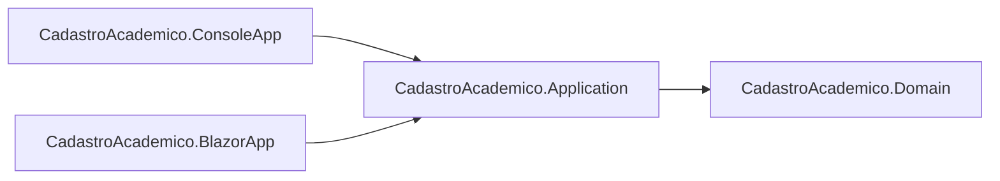

# Por Que Usar Varios Projetos na Mesma Solution

## Objetivo

Explicar por que a solution do Sistema Academico foi organizada em multiplos projetos (`Domain`, `Application`, `ConsoleApp` e `BlazorApp`) em vez de concentrar tudo em um unico projeto.

## Conceito Principal

Uma solution com varios projetos permite separar responsabilidades. Em termos praticos:

1. Cada projeto tem um papel claro.
2. Regras de negocio ficam isoladas da interface.
3. O mesmo nucleo pode ser reutilizado por interfaces diferentes (Console e Blazor).

No contexto didatico, isso ajuda o aluno a entender arquitetura em camadas de forma concreta, sem depender de banco de dados ou complexidade desnecessaria nesta fase.

## Como Isso Aparece no Projeto

A solution atual agrupa quatro projetos:

1. `CadastroAcademico.Domain`
2. `CadastroAcademico.Application`
3. `CadastroAcademico.ConsoleApp`
4. `CadastroAcademico.BlazorApp`

Cada um deles foi criado dentro de `src/` e adicionado ao arquivo `CadastroAcademico.slnx`.

## Papel de Cada Projeto

## 1) Domain

Responsabilidade:

- Modelar entidades e regras de negocio centrais.
- Proteger invariantes e estado interno.

No que ele nao deve depender:

- Console
- Blazor
- Banco de dados
- HTML

## 2) Application

Responsabilidade:

- Orquestrar casos de uso.
- Expor servicos que as interfaces consomem.
- Coordenar armazenamento em memoria nesta etapa.

Dependencia atual:

- Application depende de Domain.

## 3) ConsoleApp

Responsabilidade:

- Interface textual (menus, fluxo de interacao no terminal).
- Delegar a logica para a camada Application.

Dependencia atual:

- ConsoleApp depende de Application.

## 4) BlazorApp

Responsabilidade:

- Interface visual web (paginas, componentes, formularios, tabelas).
- Delegar a logica para a camada Application.

Dependencia atual:

- BlazorApp depende de Application.

## Mapa de Dependencias (visao rapida)

```text
ConsoleApp  ->
             Application -> Domain
BlazorApp   ->
```

## Diagrama da Arquitetura



## Exemplo no Codigo (Referencias Reais)

Application referenciando Domain:

```xml
<ItemGroup>
  <ProjectReference Include="..\CadastroAcademico.Domain\CadastroAcademico.Domain.csproj" />
</ItemGroup>
```

ConsoleApp referenciando Application:

```xml
<ItemGroup>
  <ProjectReference Include="..\CadastroAcademico.Application\CadastroAcademico.Application.csproj" />
</ItemGroup>
```

BlazorApp referenciando Application:

```xml
<ItemGroup>
  <ProjectReference Include="..\CadastroAcademico.Application\CadastroAcademico.Application.csproj" />
</ItemGroup>
```

## Por Que Esta Estrutura Foi Escolhida

A escolha foi feita para atender quatro objetivos:

1. Reuso
- Console e Blazor usam os mesmos servicos e regras.

2. Manutencao
- Mudancas de regra ficam concentradas no nucleo, sem duplicacao.

3. Evolucao
- Facilita avancar depois para API, testes e persistencia real.

4. Aprendizagem orientada a arquitetura
- O aluno enxerga na pratica o principio de separacao de responsabilidades.

## O Que Aconteceria se Tudo Ficasse em Um Projeto

Problemas comuns:

1. Regras espalhadas em Program.cs e componentes .razor.
2. Duplicacao de logica entre interface textual e visual.
3. Dificuldade para testar e evoluir.
4. Alto acoplamento entre UI e negocio.

## Erros Comuns

1. Interface chamando dominio diretamente para fluxo de caso de uso.
- Recomendacao: interface chama Application; Application coordena Domain.

2. Dominio dependente de UI.
- Recomendacao: Domain deve ser independente de Console e Blazor.

3. Colocar regra de negocio apenas na tela.
- Recomendacao: validacao essencial deve existir no dominio/servicos.

## Checkpoint de Aprendizagem

Depois desta leitura, o aluno deve conseguir responder:

1. Qual o papel de cada projeto da solution atual?
2. Por que Console e Blazor nao devem duplicar regra?
3. Qual e o fluxo de dependencias correto entre as camadas?
4. Que beneficios essa estrutura traz para evolucao futura do sistema?
