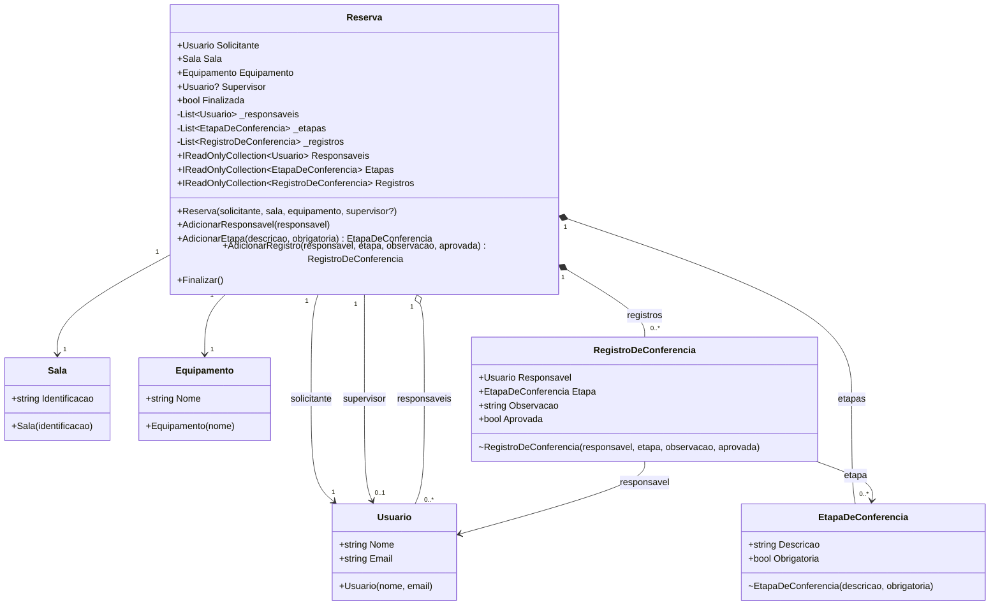

# Diagrama de Classes — Sistema de Reservas Acadêmicas

## Legenda

| Notação | Significado |
|---|---|
| `-->` | Associação |
| `o--` | Agregação (parte pode existir sem o todo) |
| `*--` | Composição (parte pertence exclusivamente ao todo) |
| `+` | Público |
| `-` | Privado |
| `~` | Internal |
| `?` | Opcional (nullable) |
