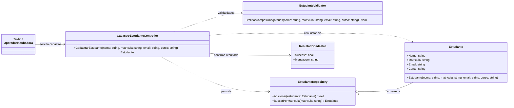

# UC01 - Cadastrar Estudante - Diagrama de Classes

Primeiro caso de uso identificado para implementacao: **UC01 - Cadastrar Estudante**.

## Classes relacionadas ao UC01

- OperadorIncubadora (ator que dispara o caso de uso)
- CadastroEstudanteController (orquestra o fluxo)
- EstudanteValidator (garante campos obrigatorios)
- Estudante (entidade de dominio criada)
- EstudanteRepository (persistencia/colecao de estudantes)
- ResultadoCadastro (retorno de confirmacao para o operador)
